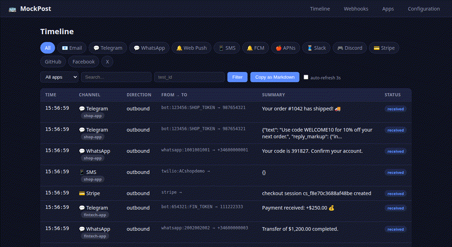
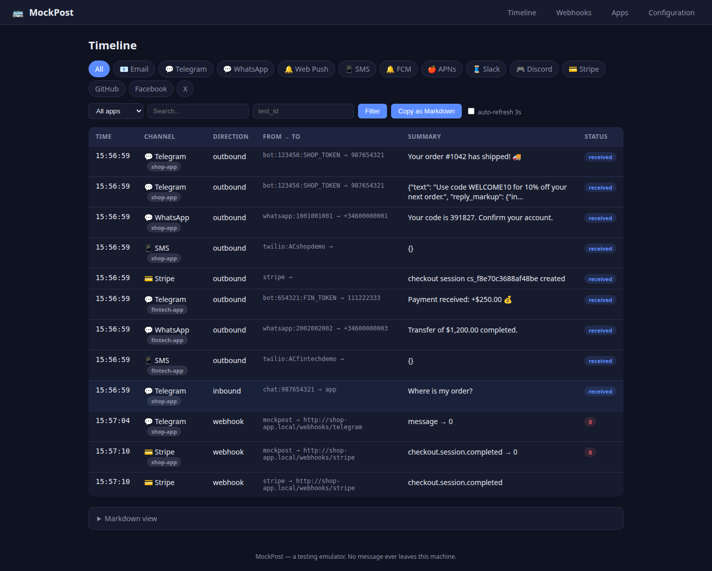
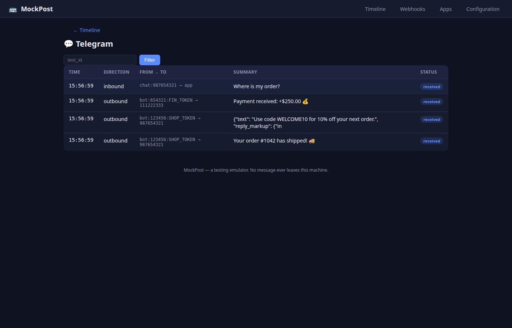
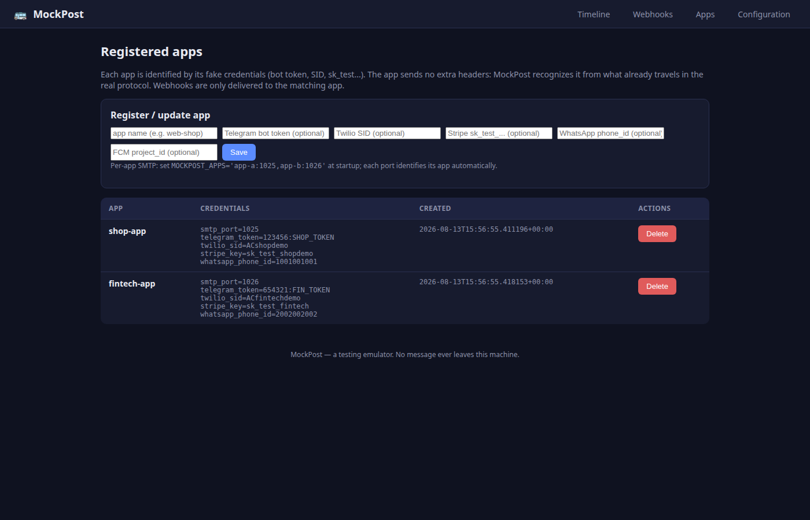

# 🚌 MockPost

**Your app thinks it's talking to Stripe, Telegram, Twilio and Gmail… but it's MockPost.**



MockPost is a local, multi-channel message emulator for end-to-end testing. Point your app's outbound credentials at MockPost and it captures **every email, Telegram message, WhatsApp message, SMS, push notification, Slack/Discord webhook, Stripe event and OAuth session** — while simulating realistic inbound events back to your app. All local, all deterministic, zero real credentials.

- **Web panel** — a unified timeline of every message across all channels, with per-channel detail, per-app filtering and a "Copy as Markdown" button.
- **MCP server** — an agent (Claude Code, OpenCode, Cursor, any MCP client) inspects the timeline, reads OTP codes and fires simulated events, all in one call.
- **Zero config faking** — your app keeps its real SDKs and its real-looking credentials; MockPost identifies each app by those credentials, so it never knows it's being faked.

> **Why?** Real services mean accidental sends, third-party credentials, and agents that can't inspect what your app actually sent. MockPost makes message delivery *observable*.

## Screenshots





---

## Quick start

### PyPI (once published)

```bash
pipx install mockpost        # or: uv tool install mockpost
mockpost                     # starts the server on :8090
# MCP server, for any harness:
pipx install mockpost && mockpost-mcp   # stdio MCP server
```

### Docker (recommended)

```bash
docker run -p 8090:8090 -p 1025:1025 -v mockpost-data:/app/data ghcr.io/reiarseni/mockpost
# panel:      http://localhost:8090
# SMTP:       localhost:1025 (no auth)
```

### From source

```bash
git clone https://github.com/reiarseni/mockpost
cd mockpost
uv venv && uv sync
uv run mockpost
```

**60-second smoke test:**

```bash
# send an email to your own machine
python -c "import smtplib; from email.mime.text import MIMEText; m=MIMEText('Your code is 123456'); m['Subject']='Verify'; m['From']='app@test.com'; m['To']='you@test.com'; smtplib.SMTP('localhost',1025).send_message(m)"
```

Then open `http://localhost:8090` — the email is on the timeline, and `get_latest_otp` will find the code `123456`.

---

## What your app should point where

| Channel | Point your app to | Typical env var |
|---|---|---|
| **Email (SMTP)** | `localhost:1025`, no auth | `SMTP_HOST=localhost`, `SMTP_PORT=1025` |
| **Telegram** | `http://localhost:8090/telegram` (bot token goes in the URL: `/bot<TOKEN>/...`) | `TELEGRAM_API_BASE_URL` |
| **WhatsApp** | `http://localhost:8090/whatsapp/v1` | `WHATSAPP_GRAPH_BASE_URL` |
| **Web Push** | `http://localhost:8090/webpush/send` — real VAPID validation | `VAPID_PUBLIC_KEY` from `/config` |
| **SMS (Twilio)** | `http://localhost:8090/twilio/2010-04-01/Accounts/AC...` (any SID works) | `TWILIO_BASE_URL` |
| **FCM** | `http://localhost:8090/fcm/v1/projects/{id}/messages:send` | `FCM_ENDPOINT` |
| **APNs** | `http://localhost:8090/apns/3/device/{token}` | `APNS_ENDPOINT` |
| **Slack / Discord** | `http://localhost:8090/slack/webhook/{id}` / `.../discord/webhook/{id}` | `SLACK_WEBHOOK_URL` |
| **Stripe** | API `http://localhost:8090/stripe/v1`, webhook secret `whsec_...` from `/config` | `STRIPE_API_BASE`, `STRIPE_WEBHOOK_SECRET` |
| **OAuth (Google/GitHub/Facebook/X)** | authorize/token/userinfo under `http://localhost:8090/oauth/...` (any client_id/secret works) | OAuth URLs |
| **GitHub webhooks** | create hook `http://localhost:8090/github/repos/{owner}/{repo}/hooks`, simulate `.../github/simulate` | `X-GitHub-Event` + `X-Hub-Signature-256` (HMAC-SHA256, your secret) |
| **Facebook webhooks** | verify `http://localhost:8090/facebook/webhook?hub.mode=subscribe&hub.verify_token=...`, simulate `.../facebook/simulate` | `hub.*` challenge + `X-Hub-Signature-256` (HMAC-SHA256, app secret) |
| **X (Twitter) webhooks** | register `http://localhost:8090/x/webhook`, CRC `.../x/webhook/crc`, simulate `.../x/simulate` | CRC `response_token` + `X-Twitter-Webhooks-Signature` (base64 HMAC-SHA256) |
| **Google OAuth extras** | `tokeninfo` + `revoke` under `http://localhost:8090/oauth/google/...` | real Google OAuth endpoints (no webhooks by design) |

The `/config` page shows exact values plus copy-paste snippets per channel.

**Inbound webhooks (back to your app):** register your app's webhook in the panel (`/webhooks`) or via MCP `register_webhook`. Simulated inbound messages, status changes and signed Stripe events are POSTed to your app's URL — and every delivery (including the app's response body, even when it was down) is recorded in the timeline.

---

## MCP integration

MockPost exposes an **MCP server over stdio**. Any harness that speaks MCP gets tools to inspect the timeline, read OTPs, and fire simulated events — so your agent can verify end-to-end behavior autonomously.

The MCP server ships with the repo and runs with `python -m mcp_server.server` (requires the Python deps from `requirements.txt`; `MOCKPOST_URL` defaults to `http://localhost:8090`).

### Claude Code

Add to your project's `.mcp.json` (project-scoped) or `~/.claude.json` / `claude_desktop_config.json` (user-scoped):

```json
{
  "mcpServers": {
    "mockpost": {
      "command": "python",
      "args": ["-m", "mcp_server.server"],
      "env": { "MOCKPOST_URL": "http://localhost:8090" }
    }
  }
}
```

### OpenCode

OpenCode supports MCP servers through its config (`opencode.json` / `opencode.jsonc`). Add the server under the `mcp` section:

```json
{
  "$schema": "https://opencode.ai/config.json",
  "mcp": {
    "mockpost": {
      "type": "local",
      "command": ["python", "-m", "mcp_server.server"],
      "environment": { "MOCKPOST_URL": "http://localhost:8090" },
      "enabled": true
    }
  }
}
```

> Some OpenCode versions use `"type": "stdio"` instead of `"type": "local"` — use whichever your installed version accepts.

### Any MCP harness (Cursor, Windsurf, VS Code, Continue, custom clients)

The universal contract is the same: run the server with `command + args`, pass env vars, done.

- **VS Code** (GitHub Copilot / MCP): `mcp add mockpost -e "python" "-m" "mcp_server.server"` or configure in `.vscode/mcp.json` / user settings under `mcp.servers`.
- **Cursor**: Settings → MCP → Add server → type `command`, command `python -m mcp_server.server`.
- **Raw JSON** (any stdio MCP client):

```json
{
  "mcpServers": {
    "mockpost": {
      "command": "python",
      "args": ["-m", "mcp_server.server"],
      "env": { "MOCKPOST_URL": "http://localhost:8090" }
    }
  }
}
```

> On Windows, wrap the command: `"command": "cmd", "args": ["/c", "python", "-m", "mcp_server.server"]`.

### What the agent can do

| Tool | Purpose |
|---|---|
| `get_timeline_markdown()` | **Call this first.** Full picture of a test run across all channels, in Markdown. |
| `list_sent_messages()` / `get_message_detail()` | Inspect captured messages (full MIME/JSON payload). |
| `simulate_incoming_message()` | Simulate a user messaging your app (Telegram/WhatsApp) — delivered to your webhook. |
| `simulate_delivery_webhook()` | Fire delivered/read/failed status changes. |
| `simulate_stripe_event()` | Send a signed Stripe event (`Stripe-Signature`) to your webhook. |
| `simulate_github_event()` / `simulate_facebook_event()` / `simulate_x_event()` | Fire signed social webhooks (X-Hub-Signature-256 / X-Twitter-Webhooks-Signature). |
| `verify_facebook_webhook()` | Returns the hub.* verification URL used by Meta. |
| `get_latest_otp()` / `generate_totp_secret()` / `get_totp_code()` | Read OTP codes / TOTP for 2FA flows. |
| `set_oauth_fake_profile()` / `get_oauth_session()` | Drive fake OAuth logins and inspect the resulting session. |
| `register_webhook()` / `trigger_webhook()` / `list_webhook_deliveries()` | Manage and verify webhooks, including what the app returned (or that it was down). |
| `set_app()` / `set_test_id()` | Scope everything to one app / one test run. |
| `clear_channel()` / `clear_all()` | Clean up between runs. |

**Typical agent flow:**

```
1. set_app("my-app")                          # scope to your app
2. (your test runs and sends emails/messages)
3. get_timeline_markdown()                    # what did my app actually send?
4. get_latest_otp("user@test.com")            # the login code, parsed for you
5. simulate_incoming_message("whatsapp", ...) # now test the reply path
6. get_timeline_markdown()                    # verify the round trip
```

---

## Per-app isolation (many apps testing at once)

Each app is identified by its **fake credentials** — it sends no extra headers, it never knows MockPost isn't the real service. Register the app once (panel `/apps` or MCP `register_app`):

| Fake credential | Channel it identifies |
|---|---|
| Telegram bot token | `telegram` |
| Twilio Account SID | `sms` |
| Stripe `sk_test_...` | `stripe` |
| WhatsApp phone_id | `whatsapp` |
| FCM project_id | `fcm` |
| SMTP port (`MOCKPOST_APPS='app-a:1025,...'`) | `mail` |

Consequences:
- Captured messages are tagged with their app (panel filters by app).
- A webhook bound to an app **only receives that app's simulated events**.
- Unregistered credentials fall into the global queue.

---

## Environment variables (all optional)

| Variable | Default |
|---|---|
| `MOCKPOST_HTTP_PORT` | `8090` |
| `MOCKPOST_SMTP_PORT` | `1025` |
| `MOCKPOST_HOST` | `127.0.0.1` (localhost only — no auth by design) |
| `MOCKPOST_SMTP_HOST` | `127.0.0.1` (localhost only) |
| `MOCKPOST_ALLOWED_WEBHOOK_HOSTS` | *(empty — all http(s) except metadata/link-local)* |
| `MOCKPOST_APPS` | `app-a:1025,app-b:1026` (per-app SMTP) |
| `MOCKPOST_DB_PATH` | `./data/mockpost.db` |
| `MOCKPOST_URL` | `http://localhost:8090` |
| `MOCKPOST_STRIPE_WEBHOOK_SECRET` | `whsec_<random>` |
| `MOCKPOST_VAPID_CONTACT` | `mailto:mockpost@test.local` |
| `MOCKPOST_OAUTH_JWT_KEY` | `<random>` |

---

## Emulated channels

Email (SMTP, no auth, MailHog-style) · Telegram Bot API (`sendMessage`/`getUpdates`/`sendPhoto`/`setWebhook`) · WhatsApp Cloud API (messages + statuses) · Web Push (real VAPID validation) · Twilio SMS (`Messages.json` + `StatusCallback`) · FCM · APNs · Slack · Discord · Stripe (checkout/payment_intents + signed `Stripe-Signature` events) · OTP (SMS/email/TOTP) · Fake OAuth2 for Google/GitHub/Facebook/X (JWT with local key) · Social webhooks (GitHub, Facebook, X) with per-provider signatures.

---

## License

MIT — see [LICENSE](LICENSE).
